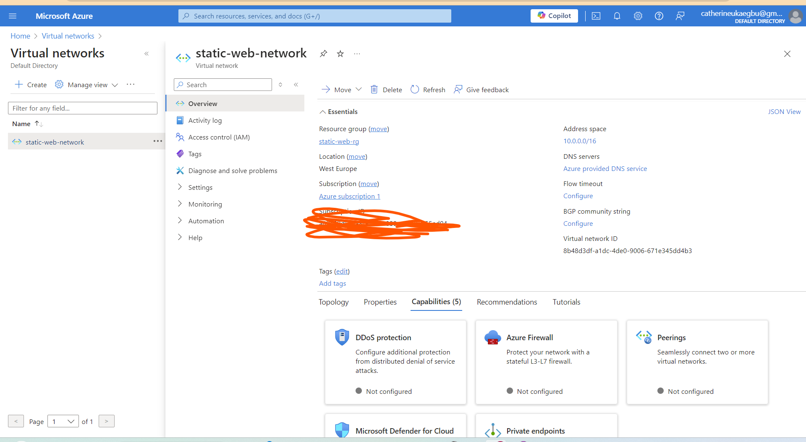
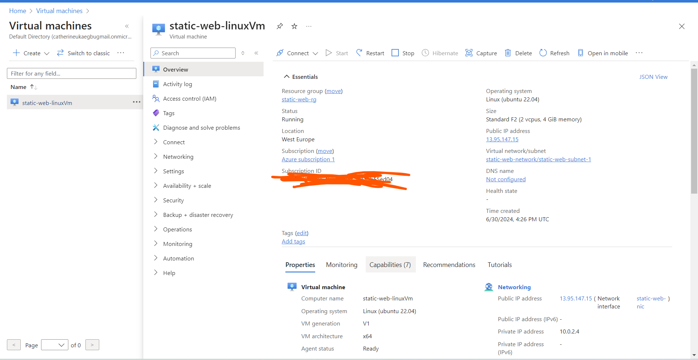

# Task: Static Website Deployment

Deploy a static website onto a cloud platform.

- Cloud Platform: Choose a cloud platform of your preference (AWS EC2, Azure, etc) to deploy your website.

- Web Server: Select a web server software like NGINX or Apache to serve your static website content.

- Website Preparation: Ensure your static website files (HTML, CSS, Javascript) are ready for deployment.

- Server Configuration: Configure the chosen web server (NGINX or Apache) on your cloud instance to serve your website content.

 # Task Solution

## Architectural flow

## Terraform
I used a terraform script to create this infrastructure and to configure it by installing apache2 and deploying the static website

I got the website template from (https://free-css.com/free-css-templates)

### Virtual network created

### Virtual Machine created

### Static website deployed

